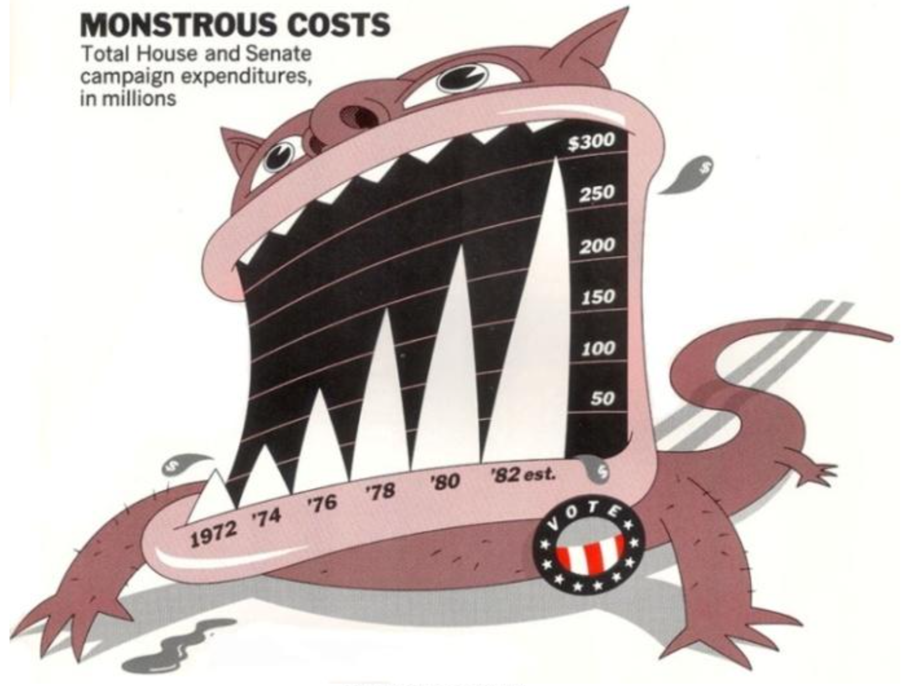
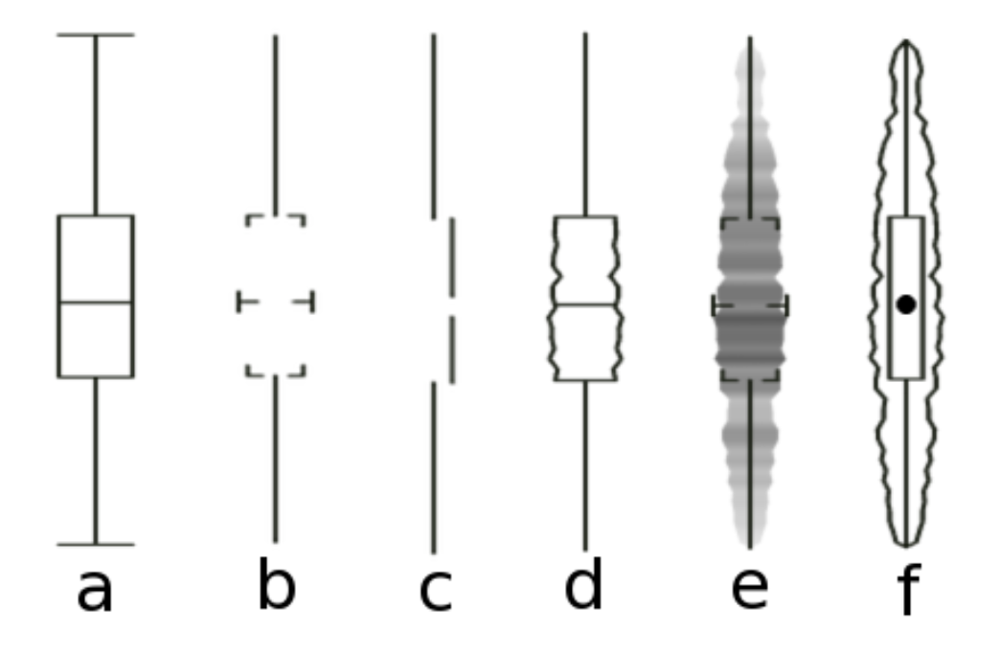
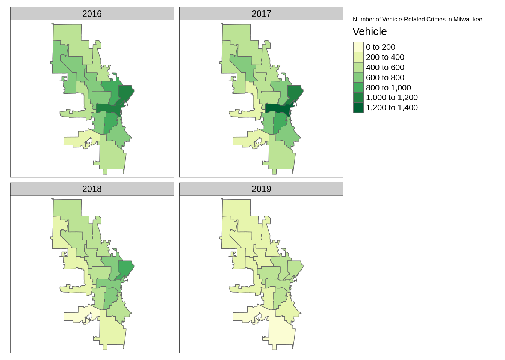

```{r setup, include=FALSE}
knitr::opts_chunk$set(echo = FALSE, warning = FALSE)
```


# 1. Elementos de la visualización de datos

## 1.1 Importancia de la visualización de datos

- ¿Por qué es útil la representación gráfica de los datos?

```{r creacion-doc, echo=FALSE, out.width = "80%", fig.align='center', fig.cap="Cuarteto de Anscombe (Muzner, 2015)"}

```

## 1.2 Estrategia de diseño y selección de gráficos

- Gran variedad de gráficos y elementos de diseño.
- ¿Qué diseño o combinación es la más adecuada para nuestro análisis?
- Una representación debe ser **sencilla**, fácil de **interpretar** y debe captar la **atención** del público.
- *Método Munzner*:

```{r what-why-how, echo=FALSE, out.width = "80%", fig.align='center'}

```

## 1.3 Tipos de datos y datasets

- Tipo vs. semántica

  - Estructura vs. significado
  
- Tipo de dato => != *formato* de almacenamiento de su valor

  - No confundir *tipo de dato* con *formato del dato*

| Tipo de dato      | Formato  | Valor |
|:------------------|:--------:|:-----:|
| Numérico          | Entero    | 3 |
| Numérico          | coma flotante | 3.276 |
| Categórico        | Etiqueta   | {1, 2, 3} |


## 1.3 Tipos de datos

```{r data-types, echo=FALSE, out.width = "60%", fig.align='center', fig.cap="(Muzner, 2015)"}
knitr::include_graphics("imagenes/data-types.svg")
```

- Tipos básicos de datos:

  - *item* = individuo
  - *atributo* = característica o variable
  - *enlace* = relación entre dos items en un grafo o red
  - *malla* = relaciones geométricas y topológicas entre celdas  
  - *posición* en datos espaciales = coordenadas en el espacio
  
- ¡¡¡Cuidado con los datos con **dependencias estrictas**!!!

## 1.3 Tipos de datasets

```{r dataset-types, echo=FALSE, out.width = "50%", fig.align='center', fig.cap="(Muzner, 2015)"}

```

- Según el almacenamiento y procesamiento de los datos -> un tipo de dataset

  - *Tablas*: los datos se representan por filas (= items) y columnas (= atributos) -> DataFrame
  - *Redes*: se representan relaciones (*enlace*) entre items
  
    - Los enlaces pueden tener atributos (grado de importancia, tipo de relación...)
    
  - *Cuerpos*: valores de atributos asociados con celdas o regiones (malla)
  - *Geometrías*: contiene información para respresentar formas -> representación de datos espaciales.

## 1.3 Tipos de gráficos

```{r dataset-availability, echo=FALSE, out.width = "40%", fig.align='center', fig.cap="(Muzner, 2015)"}

```

- Tipos de gráficos:  

  - *Estáticos*: representación fija.
  - *Dinámicos*: representación no fija -> variación de algún atributo a lo largo del tiempo (`gganimate`)

    - Interactivos: interacción del espectador (`Shiny`)

## 1.3 Tipos de gráficos

```{r shiny, echo=FALSE, out.width = "50%", fig.align='center'}

```

## 1.4 Tipos de atributos

```{r atribute, echo=FALSE, out.width = "60%", fig.align='center', fig.cap="(Muzner, 2015)"}

```

- Atributo = características de un item

  - **Categórico**: conjunto de etiquetas de identificación, no tienen orden. Ejem: colores.
  - **Ordenado**: valores ordenados entre sí -> operaciones de comparación lógica. Ejem: notas de un examen, tallas de ropa...
    
    - *Variables cuantitativas*: valores referenciados respecto a un mismo origen.
    - *Secuenciales*, *divergentes* o *cíclicos* (según la dirección de ordenación)
  
## 1.5 Marcas y canales

- *Marcas* = símbolos que se utilizan en la representación
- *Canales* de percepción

```{r marks-channels, echo=FALSE, out.width = "60%", fig.align='center', fig.cap="(Muzner, 2015)"}

```

## 1.6 Paletas de colores

- Multitud de paletas de colores
- Podemos definir la nuestra propia
- Recomendaciones:

  - Utilizar una paleta de colores existente.
  - Tener en cuenta el propósito del gráfico.
  
    - Paletas con graduación de saturación o iluminación -> atributos con valores cuantitativos.
    - Paletas con combinación de colores -> representación de varios atributos.
    
  - Revisar la documentación de los paquetes.

- Ventaja de utilizar una paleta: 

  - Tienen en cuenta la teoría del color, la interpretación del color y otros aspectos.
  - Número máximo de colores de una paleta 7-10. Excesivo número de colores genera confusión.

## 1.6 Paletas de colores

- Paquetes más conocidos de R:

  - `viridis`: diseñado para espectadores con ceguera de algún color. Se pueden convertir faciltmente a B/N.
  - `colorspace`: diseñadas dependiendo del tipo de atributo (categórico, secuencial, divergentes, etc.).
  - `RColorBrewer`: en cartografía porque tiene una herramienta interactiva de selección de paletas en función del objetivo del mapa

## 1.6 Paletas de colores  

```{r colorspace, echo=FALSE, out.width = "60%", fig.align='center'}
knitr::include_graphics("imagenes/colorspace.png")
```
  
  
# 2. Principios de visualización de datos

## 2.1 Reglas básicas

- Evitar uso de elementos y gráficos 3D representados en una área de visualización (excepto 3D inmersiva).

```{r barras_3D, echo=FALSE, out.width = "60%", fig.align='center', fig.cap="Fuente: (Healy, 2019)"}
knitr::include_graphics("imagenes/barras_3D.png")
```

## 2.1 Reglas básicas

- Evitar representación gráfica en 2D si es suficiente con una tabla o una lista.
- Utilizar elementos y canales que introduzcan poca carga cognitiva.
- Uso de animaciones = arma de doble filo. Preferencia por parrillas de gráficos

```{r crime-Milwaukee-animated, echo=FALSE, out.width = "50%"}
imag=c("imagenes/crime-Milwaukee-animated.gif","imagenes/crime-Milwaukee.png")
knitr::include_graphics(imag)
```

## 2.1 Reglas básicas

- Más reglas básicas:

  - 1º resumen global -> 2º acceso a detalles.
  - Proceso de renderizado del gráfico sea ágil.
  - Muy importante que los gráficos se puedan representar en B/N.
  - 1º gráfico funcional -> 2º gráfico bonito.

## 2.2 Principios de E. Tufte

- 1º REGLA: Maximizar data-to-ink ratio.

  - Un gráfico con muchos elementos superpuestos hará que no veamos nada -> *transparencia*
  
```{r overploting, echo=FALSE, out.width = "25%", fig.align='center', fig.cap="Fuente: [ggplot2: overplotting]"}
knitr::include_graphics("imagenes/overplotting.png")
```

## 2.2 Principios de E. Tufte

- 2º REGLA: Utilizar un tema de gráfico sencillo.

```{r monstrous, echo=FALSE, out.width = "60%", fig.align='center', fig.cap="Fuente: (Healy, 2019)"}

```

## 2.2 Principios de E. Tufte

- 3º REGLA: Priorizar los datos, sobre los elementos de diseño.

  - Cualquier elemento de diseño tiene que cumplir una función.
  - Su utilización no puede estar sujeta a un motivo estético.

```{r six-boxplots, echo=FALSE, out.width = "60%", fig.align='center', fig.cap="Fuente: (Healy, 2019)"}

```

## 2.2 Principios de E. Tufte

- 4º REGLA: Uso de facetas o grid de representaciones para las comparaciones

```{r crime-Milwaukee, echo=FALSE, out.width = "60%", fig.align='center'}

```

## 2.2 Principios de E. Tufte

- 5º REGLA: Proporcionar contexto adicional: leyenda, anotaciones...

```{r thecode3-2, echo=FALSE, out.width = "70%", fig.align='center'}

```

## 2.3 Buenas prácticas y recomendaciones

- No dar por buenas las configuraciones por defecto de bibliotecas y herramientas de visualización

  - Ejemplo diseño por defecto de `ggplot2`.
  - Aspectos +: no saturado, presentación simple y directa, leyenda
  - Aspectos -: interpretación del gráfico

```{r bad-stacked-barplot, echo=FALSE, out.width = "60%", fig.align='center', fig.cap="Fuente: (Healy, 2019)"}
knitr::include_graphics("imagenes/bad-stacked-barplot.png")
```

## 2.3 Buenas prácticas y recomendaciones

- Cuidar el ratio del aspecto de los ejes de coordenadas

```{r aspect-ratios, echo=FALSE, out.width = "80%", fig.align='center', fig.cap="Fuente: (Healy, 2019)"}
knitr::include_graphics("imagenes/aspect-ratios.png")
```

## 2.3 Buenas prácticas y recomendaciones

- Teoría de la Gestalt

  - *Proximidad*: elementos juntos tienden a ser relacionados.
  - *Similaridad*: elementos con aspecto parecido tienden a ser relacionados.
  - *Conexión*: elementos visualmente ligados tienden a ser relacionados.
  - *Continuidad*: elementos parcialmente ocultos tienden a ser completados.
  - *Cierre*: elementos sin cerrar tienden a ser cerrados.
  - *Figura y fondo*: figura en 1º plano, fondo en 2º plano.
  - *Destino común*: elementos con mismo destino se perciben como una unidad.

## 2.3 Buenas prácticas y recomendaciones

```{r ejem_gestalt, echo=FALSE, out.width = "80%", fig.align='center', fig.cap="https://platzi.com/blog/ejemplos-ley-gestalt/"}

```

## 2.3 Buenas prácticas y recomendaciones

```{r gestalt-inferences-horizontal, echo=FALSE, out.width = "80%", fig.align='center', fig.cap="Fuente: (Healy, 2019)"}
knitr::include_graphics("imagenes/gestalt-inferences-horizontal.png")
```

## 2.3 Buenas prácticas y recomendaciones

- Uso adecuado de las escalas.

  - No se pueden comparar gráficos que utilicen diferentes escalas.

```{r misleading-scale, echo=FALSE, out.width = "80%", fig.align='center', fig.cap="Fuente: (Healy, 2019)"}

```


# 3. Galería de gráficos

## 3.1 Taxonomía de gráficos

- **Análisis exploratorio de datos**

  - Representación de distribuciones de valores.
  - Resumen de propiedades de conjuntos de datos.
  - Distribuciones de valores univariantes

```{r graphs-distribution-i, echo=FALSE, out.width = "80%", fig.align='center', fig.cap="Fuente: (Wilke, 2019)"}
knitr::include_graphics("imagenes/graphs-distribution-i.png")
```

## 3.1 Taxonomía de gráficos

- **Análisis exploratorio de datos**

  - Ejemplos:

```{r eje-exploratorio, echo=FALSE, out.width = "50%"}
imgs = c("imagenes/histograma.png", "imagenes/func-densidad.png")
knitr::include_graphics(imgs)
```

## 3.1 Taxonomía de gráficos

- **Análisis exploratorio de datos**

  - Ejemplos:

```{r eje-exploratorio2, echo=FALSE, out.width = "50%", fig.align='center'}

```

## 3.1 Taxonomía de gráficos

- **Análisis exploratorio de datos**

  - Ejemplos:

```{r eje-exploratorio3, echo=FALSE, out.width = "50%"}
imgs = c("imagenes/qqplot_normal.png", "imagenes/qqplot_chisq.png")
knitr::include_graphics(imgs)
```

## 3.1 Taxonomía de gráficos

- **Análisis exploratorio de datos**

  - Distribuciones de valores en función de un atributo categórico
  
```{r graphs-distribution-ii, echo=FALSE, out.width = "80%", fig.align='center', fig.cap="Fuente: (Wilke, 2019)"}
knitr::include_graphics("imagenes/graphs-distribution-ii.png")
```

## 3.1 Taxonomía de gráficos

- **Análisis exploratorio de datos**

  - Boxplot
  
```{r boxplot, echo=FALSE, out.width = "80%", fig.align='center', fig.cap="Fuente: https://www.data-to-viz.com/caveat/boxplot.html"}
knitr::include_graphics("imagenes/boxplot-annotated.png")
```

## 3.1 Taxonomía de gráficos

- **Análisis exploratorio de datos**

  - Ejemplo boxplot con puntos

```{r boxplot-jitter, echo=FALSE, out.width = "40%", fig.align='center'}
knitr::include_graphics("imagenes/boxplot-jitter.png")
```
  
## 3.1 Taxonomía de gráficos

- **Análisis exploratorio de datos**

  - Ejemplos

```{r ejem1, echo=FALSE, out.width = "50%", fig.align='center'}

```

## 3.1 Taxonomía de gráficos

- **Análisis exploratorio de datos**

  - Ejemplos

```{r ejem1-1, echo=FALSE, out.width = "30%", fig.align='center'}

```

## 3.1 Taxonomía de gráficos

- **Análisis exploratorio de datos**

  - Ejemplos

```{r ejem2, echo=FALSE, out.width = "50%"}
imgs = c("imagenes/ejem-density-plots-overlap.png", "imagenes/ejem-ggridges.png")
knitr::include_graphics(imgs)
```

## 3.1 Taxonomía de gráficos

- **Relaciones cuantitativo-cuantitativo (gráficos X-Y)**
  
```{r graphs-scatter-i, echo=FALSE, out.width = "80%", fig.align='center', fig.cap="Fuente: (Wilke, 2019)"}
knitr::include_graphics("imagenes/graphs-scatter-i.png")
```

## 3.1 Taxonomía de gráficos

- **Relaciones cuantitativo-cuantitativo (gráficos X-Y)**

  - Ejemplos

```{r ejem3, echo=FALSE, out.width = "30%"}
imgs = c("imagenes/ejem-scatterplot.png","imagenes/ejem-bubble.png")
knitr::include_graphics(imgs)
```

## 3.1 Taxonomía de gráficos

- **Relaciones cuantitativo-cuantitativo (gráficos X-Y)**
  
```{r graphs-xy-binning, echo=FALSE, out.width = "80%", fig.align='center', fig.cap="Fuente: (Wilke, 2019)"}
knitr::include_graphics("imagenes/graphs-xy-binning.png")
```

## 3.1 Taxonomía de gráficos

- **Relaciones cuantitativo-cuantitativo (gráficos X-Y)**

  - Ejemplos
  
```{r ejem4, echo=FALSE, out.width = "60%", fig.align='center'}

```

## 3.1 Taxonomía de gráficos

- **Relaciones cuantitativo-cuantitativo (gráficos X-Y)**

  - Gráficos para representar datos con estricta dependencia temporal
  
```{r graphs-xy-lines, echo=FALSE, out.width = "80%", fig.align='center', fig.cap="Fuente: (Wilke, 2019)"}
knitr::include_graphics("imagenes/graphs-xy-lines.png")
```

## 3.1 Taxonomía de gráficos

- **Relaciones cuantitativo-cuantitativo (gráficos X-Y)**

  - Ejemplos:
  
```{r ejem5, echo=FALSE, out.width = "50%"}
imgs = c("imagenes/time-series-example.png", "imagenes/ejem-geom-smooth.png")
knitr::include_graphics(imgs)
```
  
## 3.1 Taxonomía de gráficos

- **Relaciones cuantitativo-cualitativo**
  
  - Representación de valores numéricos frente a variable categórica
  
```{r graphs-amounts-i, echo=FALSE, out.width = "70%", fig.align='center', fig.cap="Fuente: (Wilke, 2019)"}
knitr::include_graphics("imagenes/graphs-amounts-i.png")
```

## 3.1 Taxonomía de gráficos

- **Relaciones cuantitativo-cualitativo**
  
  - Ejemplo
  
```{r dotplot-comparison, echo=FALSE, out.width = "40%", fig.align='center'}

```

## 3.1 Taxonomía de gráficos

- **Relaciones cuantitativo-cualitativo**
  
  - Representación de valores numéricos frente a varias variables categóricas
  
```{r graphs-amounts-multi, echo=FALSE, out.width = "80%", fig.align='center', fig.cap="Fuente: (Wilke, 2019)"}
knitr::include_graphics("imagenes/graphs-amounts-multi.png")
```

## 3.1 Taxonomía de gráficos

- **Relaciones cuantitativo-cualitativo**
  
  - Ejemplo:
  
```{r grouped-barplot, echo=FALSE, out.width = "80%", fig.align='center'}
knitr::include_graphics("imagenes/grouped-barplot.png")
```

## 3.1 Taxonomía de gráficos

- **Relaciones cuantitativo-cualitativo**
  
```{r heatmaply, echo=FALSE, out.width = "80%", fig.align='center'}

```
  
## 3.1 Taxonomía de gráficos

- **Proporciones**.
  
```{r graphs-proportions, echo=FALSE, out.width = "60%", fig.align='center', fig.cap="Fuente: (Wilke, 2019)"}
knitr::include_graphics("imagenes/graphs-proportions.png")
```

-**Proporciones. Múltiples conjuntos de proporciones**.
  
```{r graphs-proportions-comp, echo=FALSE, out.width = "80%", fig.align='center', fig.cap="Fuente: (Wilke, 2019)"}
knitr::include_graphics("imagenes/graphs-proportions-comp.png")
```

## 3.1 Taxonomía de gráficos

- **Proporciones. Múltiples conjuntos de proporciones**.

  - Ejemplo:
  
```{r diagrama-densidad-apilado, echo=FALSE, out.width = "70%", fig.align='center'}

```

## 3.1 Taxonomía de gráficos

- **Proporciones en función de más de una variable categórica**.
  
```{r graphs-proportions-multi, echo=FALSE, out.width = "80%", fig.align='center', fig.cap="Fuente: (Wilke, 2019)"}
knitr::include_graphics("imagenes/graphs-proportions-multi.png")
```

## 3.1 Taxonomía de gráficos

- **Proporciones en función de más de una variable categórica**.

  - Ejemplo:
  
```{r ejem-proporciones, echo=FALSE, out.width = "40%", fig.align='center'}

```

## 3.1 Taxonomía de gráficos

- **Proporciones en función de más de una variable categórica**.

  - Ejemplo:
  
```{r ejem-proporciones2, echo=FALSE, out.width = "60%", fig.align='center'}

```

## 3.1 Taxonomía de gráficos

- **Datos espaciales**
  
```{r graphs-geospatial, echo=FALSE, out.width = "80%", fig.align='center', fig.cap="Fuente: (Wilke, 2019)"}
knitr::include_graphics("imagenes/graphs-geospatial.png")
```

## 3.1 Taxonomía de gráficos

- **Datos espaciales**

  - Ejemplos:
  
```{r ejem-geospatial, echo=FALSE, out.width = "50%"}
imgs = c("imagenes/election-usa-states.png","imagenes/election-usa-statebins.png")
knitr::include_graphics(imgs)
```

## 3.1 Taxonomía de gráficos

- **Representación de la incertidumbre**

  - Gráficos con márgenes de error en medidas o estimaciones estadísticas
  
```{r graphs-errorbars, echo=FALSE, out.width = "60%", fig.align='center', fig.cap="Fuente: (Wilke, 2019)"}
knitr::include_graphics("imagenes/graphs-errorbars.png")
```

  - Gráficos de distribución de probabilidad en intervalos de confianza

```{r graphs-confidence-dists, echo=FALSE, out.width = "60%", fig.align='center', fig.cap="Fuente: (Wilke, 2019)"}
knitr::include_graphics("imagenes/graphs-confidence-dists.png")
```

## 3.1 Taxonomía de gráficos

- **Representación de la incertidumbre**

  - Gráficos con bandas de intervalos de confianza

```{r graphs-confidence-bands, echo=FALSE, out.width = "60%", fig.align='center', fig.cap="Fuente: (Wilke, 2019)"}
knitr::include_graphics("imagenes/graphs-confidence-bands.png")
```

```{r ejem-lm-confint, echo=FALSE, out.width = "40%", fig.align='center'}

```

## 3.2 Árbol de decisión: ¿qué gráfico escojo?

- Multitud de tipos de gráficos entre los que escoger.

[Resumen diagrama de decisión](https://www.data-to-viz.com)


# 4. Gramática de gráficos

## 4.1 Origen y propósito

- **Gramática de gráficos**:

  - Paradigma de diseño de gráficos
  - Creado por Wilkinson
  - Organizar y estructurar los elementos de un gráfico
  - Lo siguen muchas bibliotecas y paquetes de visualización, ejem: `ggplot2`

## 4.1 Origen y propósito

- Elementos de la gramática de gráficos:

  - Datos:
  - Transformaciones
  - Elementos (puntos, líneas) y sus atributos (color, tamaño)
  - Escala de representación 
  - Guías de interpretación
  - Sistema de coordenadas (cartesiano, polar...)
  - Facetas (grid)
  - Otros: elementos estéticos, geometrías...
  
## 4.1 Origen y propósito

```{r tabla, echo=FALSE, out.width = "60%", fig.align='center'}

```

## 4.2 Una implementación por capas

- H. Wickham:

  - Organización de elementos por capas
  
```{r layered-grammar-graphics, echo=FALSE, out.width = "40%", fig.align='center'}

```

## 4.3 Otras librerías y paquetes

```{r r-python, echo=FALSE, out.width = "70%", fig.align='center'}

```


